# Are we facing a climate change awareness pandemic?
## How did the COVID-19 pandemic impact our interest in the climate crisis?

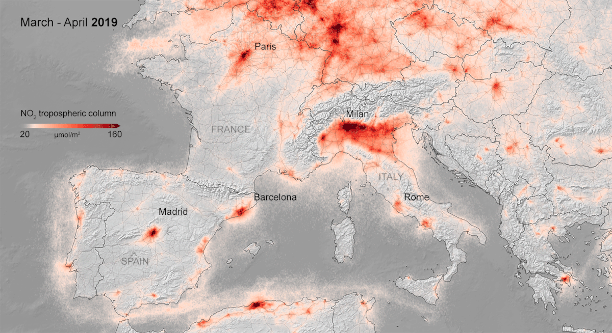

Source : [Europeen Space Agency](https://www.esa.int/Applications/Observing_the_Earth/Copernicus/Sentinel-5P/Air_pollution_remains_low_as_Europeans_stay_at_home)

In the beginning of the year 2020, the World suddenly had to stop as the spread of the SARS-CoV-2 virus became a too serious threat. This quite directly reflected in the overall air quality and [revealed the impact we have on it](https://www.pnas.org/doi/10.1073/pnas.2006853117) (Venter, Aunan, Chowdhury, Lelieved 2020).
As people spent increasing time at home and lost their bearings, it gave them time to reflect on their usual lifestyle and consumptions habit, which as it was now made visible, had a great impact on the environment.

Based on **Wikipedia** article page views, we will aim at discerning the effect of the 2020 lockdown on the interest for the climate crisis. This will be done at different scales, and by analyzing the emerging lexical themes in the researched articles. We will also link this to the restriction level of the concerned countries. For more information on how this was done, see the [Method](#method) section in the About page).

## How did the covid crisis impact people's lifestyle, mobility and localization ?
The effect of the pandemic on the mobility were drastic. Starting around early March, the transit, driving and walking time, reported from Apple mobile phones,  drastically decreased in most countries. The changes range from only small changes in certain countries like Sweden to up to 10% of the baseline value for the countries with strictest lockdown like Italy or France.

<label for="mobility">Choose a type of mobility to display its evolution over time:</label>
<select name="mobility" id="mobility">
    <option value="Driving">Driving</option>
    <option value="Transit">Transit</option>
    <option value="Walking">Walking</option>
  </select>

  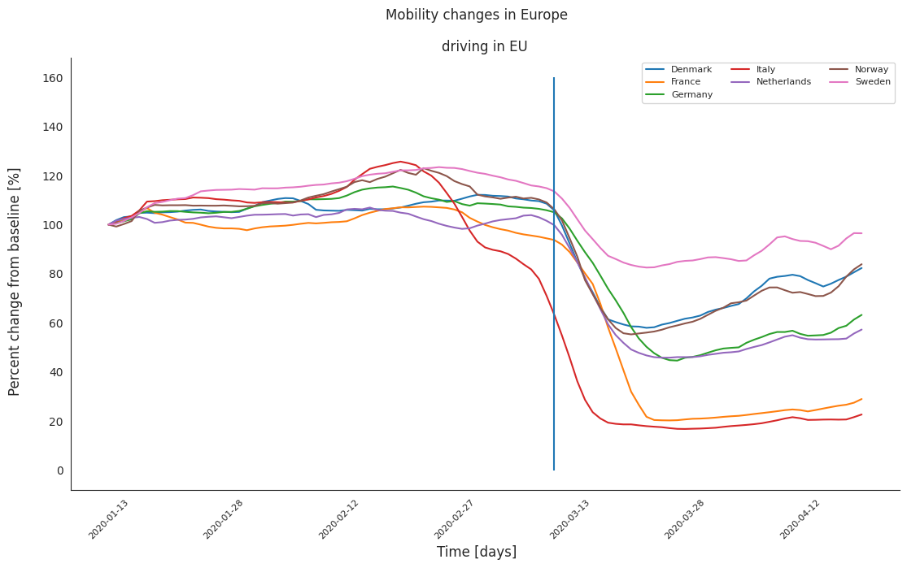

  
    
Already though, we can see some discrepancy between countries, resulting from the different policies in place in the countries. Italy and France which suffered a lot from the COVID-crisis were forced to set up strict restriction policies that strongly affected the mobility of their population. On the contrary, northern countries like Norway or Sweden were much less affected, therefore set up less restrictive policies.

The social life cycle of people living in Europe in mainly driven by weeks. It follows that mobility should also be highly influenced by a weekly pattern. This is why it it interesting to look at these results when they are smoothed on a weekly basis.

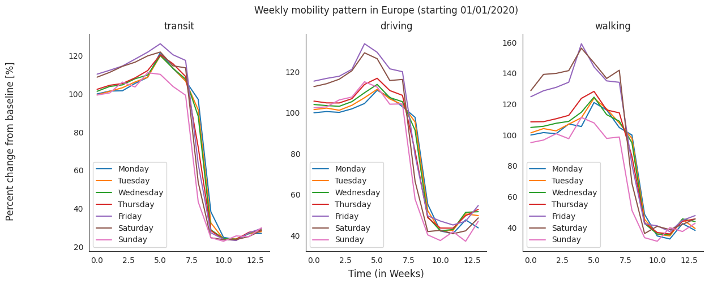

Before the pandemic and the lockdown hit, Fridays and Saturdays were consistently more active than the rest of the days in terms of mobility. However, one of the first visible effect of the pandemic, once restriction hit, is not only that the mobility drastically decreased, but also that this weekly pattern disappeared. This suggests that the covid pandemic not only affected people’s mobility, but also their behaviour.

## Is the mobility evolution correlated with a higher number of overall Wikipedia searches?

With this kind of beneficial changes on the planet, could it be that the covid-crisis managed to question society on its relationship to mobility, and furthermore on the impact of the society on the ecosystem? Did people gain interest in the ecological cause?

A great data source to capture the population’s interest is the Wikipedia database. By looking at the number of views in the articles on Wikipedia, it is easy to observe, in real time, the concerns and interest of a population. We can, in the first place, look at the total number of english written article views (smoothed by averaging by week):

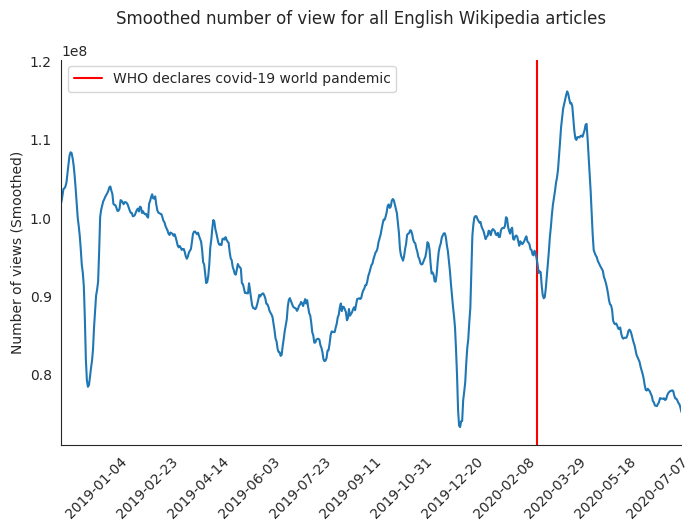

As shown in [Sudden Attention Shifts on Wikipedia During the COVID-19 Crisis](https://ui.adsabs.harvard.edu/abs/2020arXiv200508505H/abstract), there was an increased number of Wikipedia searches, correlating with an increased time spent at home for specific countries. We can thus hypothesize that the population turned to Wikipedia as a source of information, and that the number of Wikipedia page views can reflect the population’s interest during the pandemic.

We will now dig in deeper in the subject, and focus on the interest of people towards ecology specifically, and try to answer following question:

## Overall, how did interest in ecology change during the covid pandemic?

If we take the general theme of climate change (which is now strongly established in our modern society as a major ecological problem) and look at the number of Wikipedia searches related to this thematic, we should be able to depict people’s interest towards ecology.

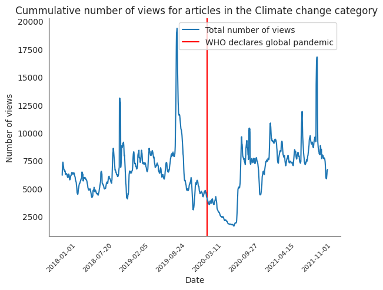{: .center}

As we can see, maybe surprisingly, there is a steep fall in interest for climate change related topics during the time of the covid pandemic. This is contrary to the effect observed in the previous figure, which showed an increase in the total number of wikipedia page views. To better understand this apparent disinterest toward climate change, we will now deepen our analysis.

## How did the severity of lockdown in a country have an impact on the disinterest toward ecological topics? (Does a more severe lockdown increase the observed trends?)  

Policies notably differed between countries. However, no metric exists to assess this. For example, how can we distinguish quantitatively between a country like Italy, where the population was heavily restricted in all external areas, and a country like Sweden (a country with notoriously nonrestrictive measures) where there was only a slight decrease in workplaces occupation, recreation areas and transit stations?

 | 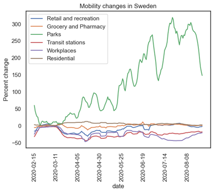

Our idea is thus to leverage on the **Mobility dataset** made available by [Google](https://www.google.com/covid19/mobility/) (shown above) to compute an "impact" metric for each country. To do so, we came up with a "lockdown impact factor", which combines the different types of mobility restriction.

In this context, we assume that restriction to workplaces and recreational area, and increased time spent at home would be indicative of a more restrictive lockdown.

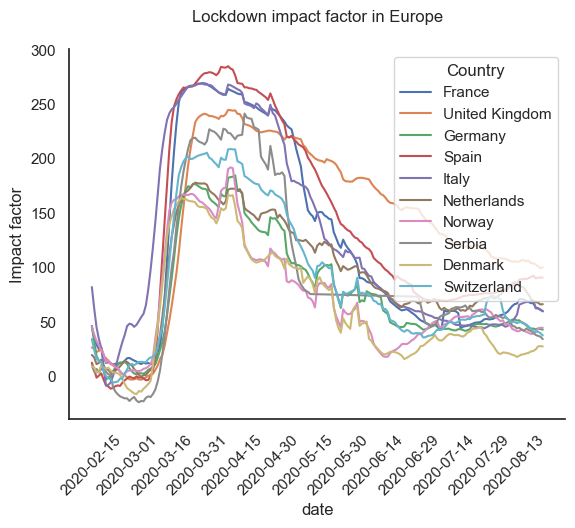{: .center}

The metric is computed based on the rationale shown in the table below, where percent change in the mentioned access area was subtracted if it was increased in less restrictive lockdowns.

| Access area          | Restrictiveness |
|----------------------|----------------|
| Transit stations     | -              |
| Workplaces           | -              |
| Retail and recreation| -              |
| Residential area     | +              |
| Parks                | -              |

Note that the ``+`` and ``-`` symbols indicate whether increased access in a particular area indicates a more or less restrictive lockdown, respectively.

Though only observational, this plot is in agreement with the general public’s opinion of the strictness of different countries. For example, nordic countries such as Norway and Denmark had less restrictive lockdown, while France and Spain had very strict lockdown (with ban on leaving the house for example). Also, we can see the delayed trend in United Kingdom, where the ban was not really lifted as quickly as in the other countries.

For the upcoming analyses, we will study the cases of 7 european countries with distinct languages. This will allow us to link the wikipedia language trends to the country national events (1st case, lockdown, back to normalcy). The selected countries are: France, Italy, Germany, Denmark, Netherlands, Sweden, and Norway.

We will look at the global evolution of the interest towards "climate change" before (baseline) and during the lockdown (lockdown). The mean number of pageviews for the selected countries is taken both for the time frame of the lockdown and the same time frame before the lockdown. The time period were adapted for each country, based on the duration of the lockdown in each country.

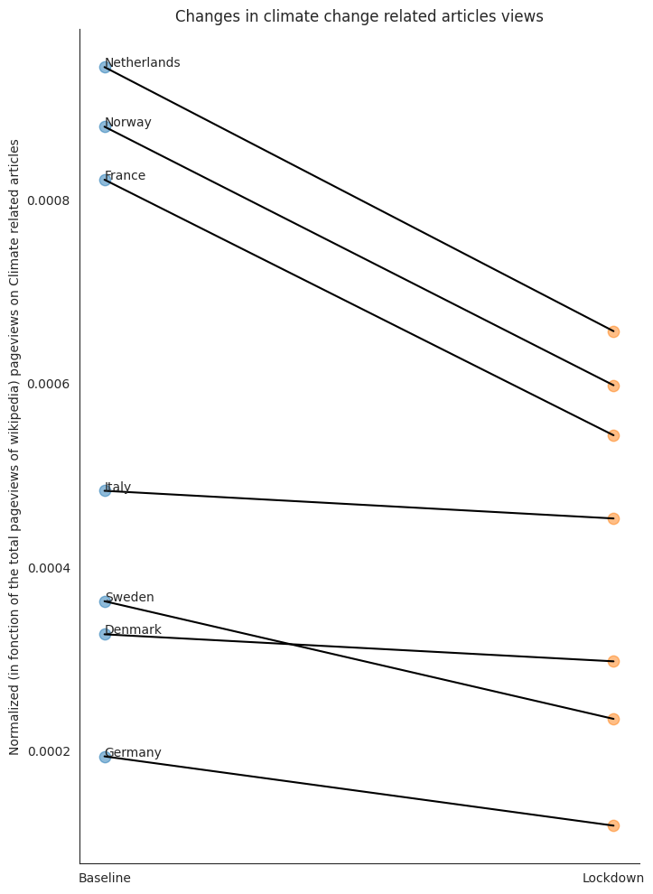

Overall, the number of pageviews in the Climate Change article decreased during the Lockdown time, even when taking into account the relative change in overall pageviews. This is quite surprising when considering that the overall trend was an increased in searches! However this seems to be similar across countries, independently of the lockdown strictness.

##  Which subjects within the theme of climate change gained or lost popularity during the lockdown period?

As we have seen, the total number of research in the topics of climate change decreased drastically during the pandemic time. However, it can be interesting to dig a bit deeper into this, and investigate the evolution of the searches regarding these topics. By looking in details at the article views contained within the english Wikipedia category "Climate change", we see that the decrease in topic search is not uniform:

<label for="period">Choose a period to display info:</label>
<select name="period" id="period">
    <option value="Before">Before</option>
    <option value="During">During</option>
    <option value="After">After</option>
  </select>

  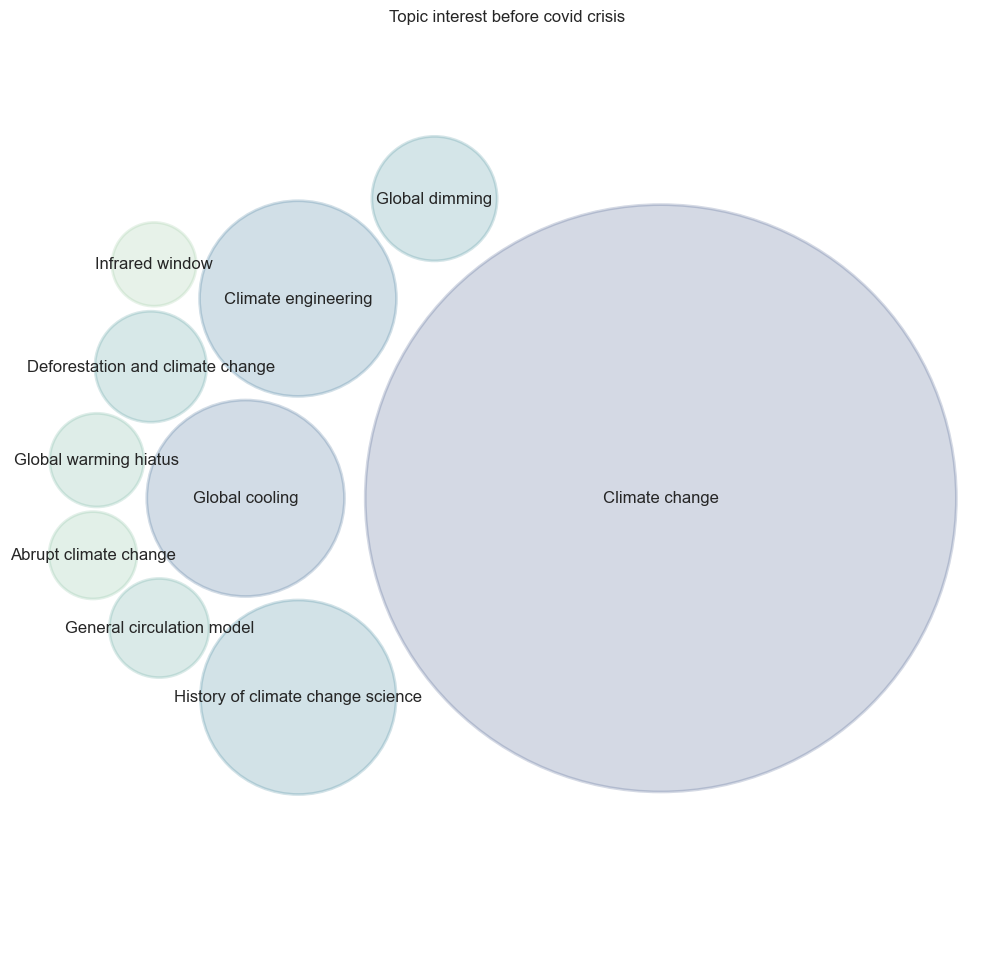

  

Though the main topic always remains "Climate change", and the top 10 consulted topics remain overall the same, we observe a difference in the interest pattern. Before the crisis, the main focus was on "Climate change", with 3-4 trending topics and 5-6 smaller topics. During the crisis, though we have seen that the overall number of searches in this category declines, it does not appear to be uniformly decreasing. Indeed, there is an homogenization of the number of pageviews for previously less popular topics. Interestingly,  this trend fades during the summer, as it tends to go back to the pattern observed before the crisis. Also, after the covid crisis, "Transition town" emerges in the top10 at the expense of "Global warming hiatus".

We can observe a global shift in the attention pattern, but to find trends in the topic shift attention, we need to look at the differential research for each of the top 30 articles related to climate change

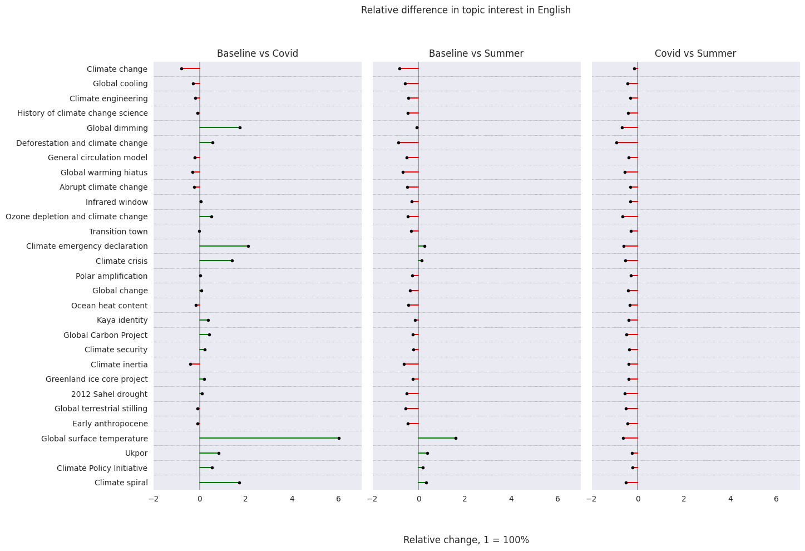{: .center}

First, we can observe that the subjects that mostly caught the public attention namely "Climate crisis", "Climate emergency declaration" and "Global dimming" are all articles with the most ‘catastrophic’ wording.

Though the global topic, and the global number of views for the topic ‘Climate change’ diminished during this period, articles with themes related to the urgency of the situation seemed to gain in popularity!

There is also a "back to normalcy" effect, described here as the "summer" period, where all subject related to Climate change, diminished in popularity compared to the lockdown period.

To further investigate this, we took the top 30 articles that had the most differential pageviews during the lockdown period and we classified them into 3 categories: `negative`, `neutral` and `positive`:

 - `negative` articles with a more dramatic / pessimistic tone, such as ‘Climate crisis’, ‘Global dimming’
 - `neutral` articles with a more neutral / scientific tone, such as ‘CO2 emissions’, ‘CO2 equivalent’
 - `positive` articles about possible solutions and about conferences and declarations, such as ‘Paris Agreement’, ‘Green New Deal’
  
We can observe that the interest in the `negative` increased more for the countries that had a more restrictive lockdown. For the other categories no clear trend is observed.

<label for="appreciation">Choose which types of articles to see on the plot :</label>
<select name="appreciation" id="appreciation">
    <option value="Negative">Negative</option>
    <option value="Neutral">Neutral</option>
    <option value="Positive">Positive</option>
    <option value="All">All</option>
  </select>

  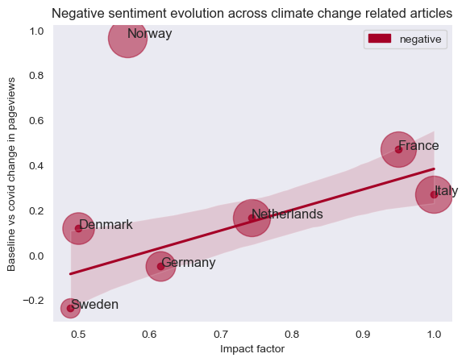

  

## How to maintain awareness of the ecological questions during a world crisis?

These results were found for the English Wikipedia category. However, though global, the pandemic was handled very differently within countries. 
Based on the previous finding, we could assume that the shifting pattern of interest might be different in other countries. The following animation allows to choose each of the seven analysed european countries and see its pattern of interest change. The top 3 articles which have seen the highest increase during covid crisis, as well as the country's lockdown impact factor ranking (among the seven analysed countries), are also highlighted. 

<label for="country">Choose a country to display info:</label>
<select name="country" id="country">
    <optgroup label="Europe">
      <option value="Italy">Italy</option>
      <option value="Denmark">Denmark</option>
      <option value="France">France</option>
      <option value="Germany">Germany</option>
      <option value="Netherlands">Netherlands</option>
      <option value="Norway">Norway</option>
      <option value="Sweden">Sweden</option>
    </optgroup>
  </select>

  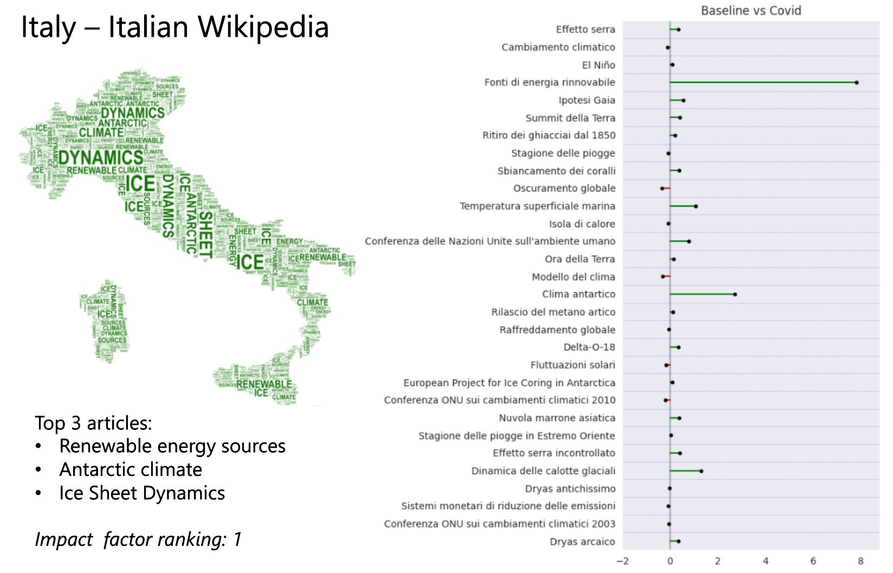

  
  
  
Now let's imagine you are an european reporter and want to write an article on the broad subject of climate change. Unfortunately, a new global crisis is taking place at that moment, and you do not know how to ensure that you article will raise awareness toward this crucial subject. You are worried as you know based on previous studies that there seems to be a decrease in climate change awareness during crisis periods. 

What we propose it that you pick one or more subjects from the following list, which regroups the top 3 subjects that have seen the highest interest increase during the Covid-19 crisis in the analysed countries. Note that here we only extracted articles which were non country-specific, in order to increase a broad public interest.

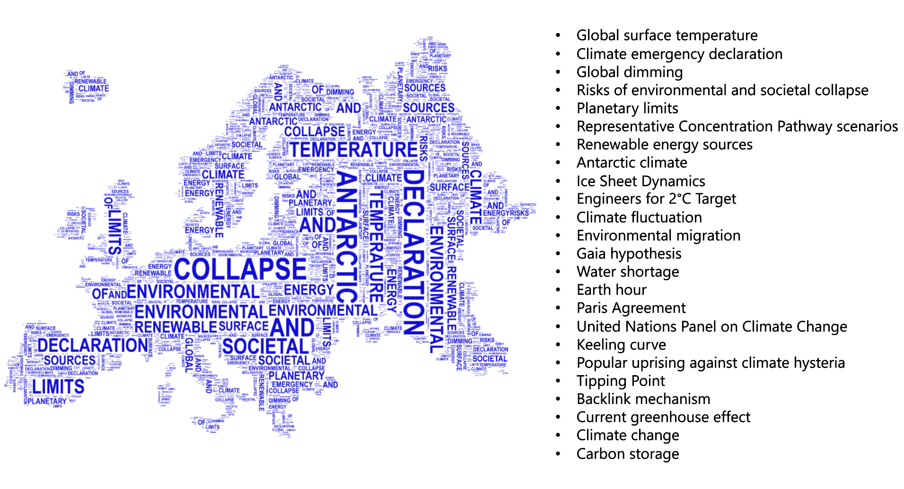

Based on the wikipedia data during the Covid-19 crisis, by choosing your subject within this list you should be able to maximize the awareness toward your article in the domain of climate change.
  
 
