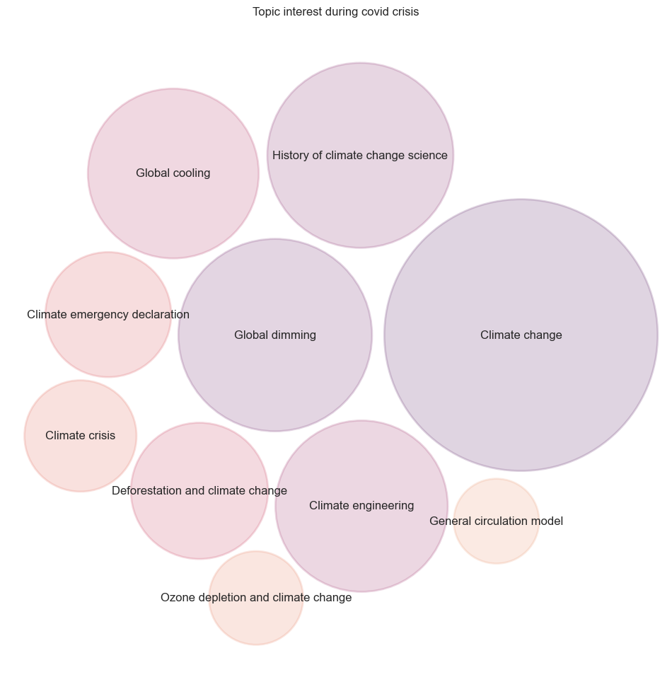
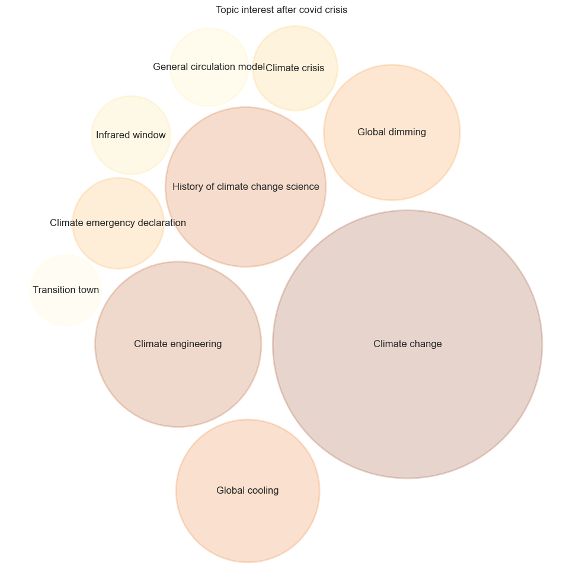

# Are we facing a climate awareness pandemic?
## How did the COVID-19 pandemic impact our interest in the climate crisis?

As expected, the effect of the pandemic on the mobility were drastic, and starting around early March, the transit, driving and walking time dramatically deceased to around ~30% compared to the baseline. Already though, we see quite some discrepancy between countries.

Now, these results are smoothed on a weekly basis, and in fact all mobility behavior were previously highly influenced by a weekly pattern.

Before the pandemic and lockdown hit, Fridays and Saturdays were consistently more active than the rest of the days. However, we can see one of the first effect of the pandemic, once restriction hit, not only did mobility drastically decrease, but also the weekly pattern was lost. 

This shows that the covid pandemic not only affected people's mobility, but also their behaviour.

In fact, the impact on air population was immediately visible and [revealed our impact on the air quality](https://www.pnas.org/doi/10.1073/pnas.2006853117) (Venter,Aunan,Chowdhury, Lelieved 2020).

With this kind of beneficial changes on the planet, could it be that the covid-crisis managed to question society on its relationship to mobility, and furthermore on the impact of the society on the ecosystem? Did people gain interest in the ecological cause?

As shown in [Sudden Attention Shifts on Wikipedia During the COVID-19 Crisis](https://ui.adsabs.harvard.edu/abs/2020arXiv200508505H/abstract), there was an increased number of Wikipedia searches, correlating with an increased time spent at home for specific countries. We can thus hypothesize that the population turned to Wikipedia as a source of information, and that the number of Wikipedia page views can reflect the population’s interest during the pandemic. This is confirmed by the following graphs that show an global increased number of Wikipedia searches correlated with the time spent at home.

We will now focus our research on the particular interest of people towards ecology, and try to answer following question:

### Globally, did interest in ecology change during the covid pandemic?

If we take the general theme of climate change (which is now strongly established in our modern society as a major ecological problem) and look at the number of Wikipedia searches related to this thematic, we should be able to depict people's interest towards ecology.

{: .center}

As we can see, there is a deep fall in interest for climate change related topics during the time of the covid pandemic. 

---TO BE CONTINUED

### How did the severity of lockdown in a country have an impact on the disinterest toward ecological topics? (Does a more severe lockdown increase the observed trends?)  

However, we don’t have a metric (yet!) to assess this. Our idea is thus to leverage on the Mobility dataset, assuming that restriction to workplaces and recreational area and increased access to home would be indicative of a more restrictive lockdown, we can compute an impact metric for each country.
For example how can we distinguish quantitatively between a country like Italy where increase in residential area was strong and access to all other areas heavily restricted (by up to ~-90%), and a country like Sweden (a country with notoriously nonrestrictive measures), Where in fact there was a slight decrease in Workplace occupation and a nearly constant residential occupation.

 | 

In order to have a quantitative metric, we came up with a ‘lockdown impact factor’, which combines the different types of mobility restriction. 

This metric is computed based on the rationale shown in the table below, where percent change in the mentioned access area was subtracted if it was increased in less restrictive lockdowns.

{: .center}

This metric is computed based on the rationale shown in the table below, where percent change in the mentioned access area was subtracted if it was increased in less restrictive lockdowns.

| Access area          | Restrictiveness |
|----------------------|----------------|
| Transit stations     | -              |
| Workplaces           | -              |
| Retail and recreation| -              |
| Residential area     | +              |
| Parks                | -              |

Note that the `+` and `-` symbols indicate whether increased access in a particular area indicates a more or less restrictive lockdown, respectively.

Though only observational, this is in agreement with the general public’s opinion of the strictness of different countries (nordic countries such as Norway and Denmark) had less restrictive lockdown, while France and Spain had very strict lockdown (with ban on leaving the house for example). We also can see the trend in United Kingdom, where the ban was not really lifted as quickly as other countries. 
Indeed, the mean number of pageviews on the article ‘Climate change’ (or the one corresponding in the countries’ language) had the following evolution. The average is taken within the time specified as ‘Lockdown’ and ‘Normalcy’ in the provided data for the ‘before’ point, and on the same number of days before Lockdown. The time period were adapted for each country.

Overall, the number of pageviews in the Climate Change article decreased during the Lockdown time, even when taking into account the relative change in overall pageviews. This is quite surprising when considering that the overall trend was an increased in searches! 

Taken together, we can hypothesize that the country’s level of lockdown restrictiveness could have some impact on the interest level shift, but once. Indeed France was in the most restrictive countries (according to the impact factor) and it has the biggest shit, whereas Nordic countries such as Norway and Danemark which had lower impact factor have a more stable evolution in the page consultation average.

##  Which subjects within the theme of climate change gained or lost popularity during the lockdown period?

As we have seen, the total number of research in the topic of climate change decreased drastically during the pandemic time. However, it is important to dig a bit deeper into this, and investigate the research behavior regarding this topic.
By splitting the search further and looking in details at the article views contained within the Wikipedia category ‘Climate change’, we see that the decrease in topic search is not uniform:
With 10 :

 |  | 

Test with interactive for bubbles: 
<label for="period">Choose a period to display info:</label>
<select name="period" id="period">
    <option value="Before">Before</option>
    <option value="During">During</option>
    <option value="After">After</option>
  </select>

  

  

Though the main topic always remains ‘Climate change’, and the top10 topics overall remains the same, we observe a difference in the interest pattern. Before the crisis, the main focus was on ‘Climate change’, with 3-4 trending topics and 5-6 smaller topics. During the crisis, though we have seen that the overall number of searches declines, it does not appear to be uniformly decreasing. Indeed, there is a homogenization of the number of pageviews for previously less popular topics. Interestingly,  this trends fades during the summer, as it tends to go back to the pattern observed before the crisis. Also, after the covid crisis, ‘Transition town’ emerges in the top10 at the expense of ‘Global warming hiatus’.

With 20:

`3 images bulles`

We can observe a global shift in the attention pattern, but to find trends in the topic shift attention, we need to look at the differential expression for each of the top 20 subjects related to climate change

{: .center}

Immediately, one can see a really interesting pattern in the subjects that caught the public attention, ‘Climate crisis’, ‘Climate emergency declaration’, and ‘Global dimming’ are all articles with the most ‘catastrophic’ wording.
Though the global topic, and the global number of views for the topic ‘Climate change’ diminished during this period, articles with themes related to the urgency of the situation, gained in popularity!
There is also a ‘summer’ effect, where all subject related to Climate change, diminished in popularity compared to the lockdown period.

What we can also note is the interest in global emission pattern through the article on ‘Ozone depletion and climate change’

{: .center}

> as a comparison point, this is the data for the same time period but the year previous covid (2019).
> ! needs to be done !

We see that topics also fluctuate between time period but in this case, the overall topic ‘Climate change’ is quite stable and there is no clear common themes between the most differentially researched topics. Moreover, the topics linked to the ‘urgency’ are not even in the top20 researched topics (see ‘Climate crisis’ and ‘Climate emergency declaration’)

These results were found for the English Wikipedia category, however, though global, the pandemic was handled very differently within countries. 
Based on the previous finding, we could assume that the shifting pattern of interest might be more or less pronounced based on the strictness of the Lockdown.

## Test

<label for="country">Choose a country to display info:</label>
<select name="country" id="country">
    <optgroup label="Europe">
      <option value="Italy">Italy</option>
      <option value="Sweden">Sweden</option>
    </optgroup>
    <optgroup label="Other">
      <option value="USA">USA</option>
    </optgroup>
  </select>

  

  
