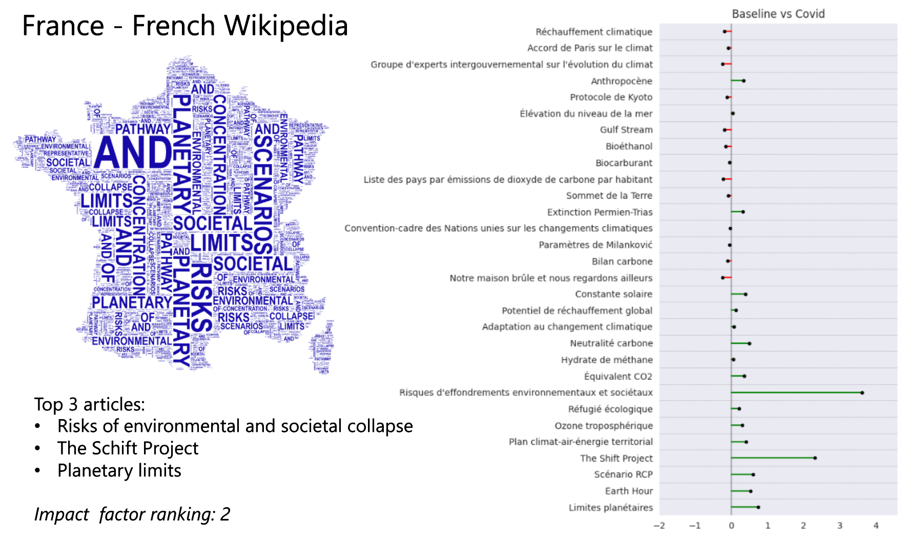

# Are we facing a climate awareness pandemic?
## How did the COVID-19 pandemic impact our interest in the climate crisis?

Source : [Europeen Space Agency](https://www.esa.int/Applications/Observing_the_Earth/Copernicus/Sentinel-5P/Air_pollution_remains_low_as_Europeans_stay_at_home)

In the beginning of the year 2020, the World suddenly had to stop as the spread of the SARS-CoV-2 virus became a too serious threat. This quite directly reflected in the overall air quality and [revealed our impact on the air quality](https://www.pnas.org/doi/10.1073/pnas.2006853117) (Venter, Aunan, Chowdhury, Lelieved 2020).
As poeple spent increasing time at home and lost their bearings, it gave them time to reflect on their usual lifestyle and consumptions habit, which as it was now made visible, had a great impact on the global air quality.

Based on **Wikipedia** article page views, we will aim at discerning the effect of the 2020 lockdown on the interest for the climate crisis. This will be done at different scales, and by analyzing the emerging lexical themes in the researched articles. We will also link this to the restriction level of the concerned countries (see  [Method](#method) section).

## How did the covid crisis impact people's lifestyle, mobility and localization ?
Indeed, the effect of the pandemic on the mobility were drastic, and starting around early March, the transit, driving and walking time, reported from Apple mobile phones, dramatically decreased to around ~30% compared to the baseline. 

<label for="mobility">Choose a type of mobility to display its evolution over time:</label>
<select name="mobility" id="mobility">
    <option value="Driving">Driving</option>
    <option value="Transit">Transit</option>
    <option value="Walking">Walking</option>
  </select>

  

  
    
Already though, we see quite some discrepancy between countries, resulting from the different policies in place in the countries.

Now, these results are smoothed on a weekly basis, and in fact all mobility behavior were previously highly influenced by a weekly pattern.

Before the pandemic and lockdown hit, Fridays and Saturdays were consistently more active than the rest of the days. However, one of the first visible effect of the pandemic, once restriction hit, is not only that the mobility drastically decreased, but also that this weekly pattern disappeared. This suggests that the covid pandemic not only affected people's mobility, but also their behaviour.

With this kind of beneficial changes on the planet, could it be that the covid-crisis managed to question society on its relationship to mobility, and furthermore on the impact of the society on the ecosystem? Did people gain interest in the ecological cause?

A great data source to capture the population's interest is the Wikipedia database. It allows to follow, in real time, the concerns and interest of a population and is easily accessible.

---> insert our plot instead 

As shown in [Sudden Attention Shifts on Wikipedia During the COVID-19 Crisis](https://ui.adsabs.harvard.edu/abs/2020arXiv200508505H/abstract), there was an increased number of Wikipedia searches, correlating with an increased time spent at home for specific countries. We can thus hypothesize that the population turned to Wikipedia as a source of information, and that the number of Wikipedia page views can reflect the population’s interest during the pandemic. This is confirmed by the following graphs that show an global increased number of Wikipedia searches correlated with the time spent at home.

{: .center}

We will now dig in deeper in the subject, and focus on the interest of people towards ecology specifically, and try to answer following question:

## Overall, how did interest in ecology change during the covid pandemic?

If we take the general theme of climate change (which is now strongly established in our modern society as a major ecological problem) and look at the number of Wikipedia searches related to this thematic, we should be able to depict people's interest towards ecology.

{: .center}

As we can see, maybe surprisingly, there is a steep fall in interest for climate change related topics during the time of the covid pandemic. This is contrary to the effect observed in the previous figure, which showed an increase in the total number of wikipedia page views. To better understand this apparent disinterest toward climate change, we will now deepen our analysis.

## How did the severity of lockdown in a country have an impact on the disinterest toward ecological topics? (Does a more severe lockdown increase the observed trends?)  

Policies notably differed between countries, however, no metric exists to assess this.
For example how can we distinguish quantitatively between a country like Italy where increase in residential area was strong and access to all other areas heavily restricted (by up to ~-90%), and a country like Sweden (a country with notoriously nonrestrictive measures) where there was only a slight decrease in Workplace occupation and a nearly constant residential occupation?

 | 

Our idea is thus to leverage on the **Mobility dataset** made available by [Google](https://www.google.com/covid19/mobility/) (shown above) to compute an 'impact' metric for each country. In order to have a quantitative metric, we came up with a ‘lockdown impact factor’, which combines the different types of mobility restriction. 

In this context, we assume that restriction to workplaces and recreational area and increased access to home would be indicative of a more restrictive lockdown.
{: .center}

The metric is computed based on the rationale shown in the table below, where percent change in the mentioned access area was subtracted if it was increased in less restrictive lockdowns.

| Access area          | Restrictiveness |
|----------------------|----------------|
| Transit stations     | -              |
| Workplaces           | -              |
| Retail and recreation| -              |
| Residential area     | +              |
| Parks                | -              |

Note that the `+` and `-` symbols indicate whether increased access in a particular area indicates a more or less restrictive lockdown, respectively.

Though only observational, this is in agreement with the general public’s opinion of the strictness of different countries. For exemple, nordic countries such as Norway and Denmark had less restrictive lockdown, while France and Spain had very strict lockdown (with ban on leaving the house for example). We also can see the trend in United Kingdom, where the ban was not really lifted as quickly as other countries. 

Indeed, the mean number of pageviews on the article ‘Climate change’ (or the one corresponding in the countries’ language) had the following evolution. The average is taken within the time specified as ‘Lockdown’ and ‘Normalcy’ in the provided data for the ‘before’ point, and on the same number of days before Lockdown. The time period were adapted for each country.

{: .center}

Taken together, we can hypothesize that the country’s level of lockdown restrictiveness could have some impact on the interest level shift, indeed France was in the most restrictive countries (according to the impact factor) and it has the biggest shift, whereas Nordic countries such as Norway and Danemark which had lower impact factor have a more stable evolution in the page consultation average.

But once taking into account the overal change in Wikipedia views for each country, and comparing the number of views to the impact factor, the interpretation we can make differs.

Overall, the number of pageviews in the Climate Change article decreased during the Lockdown time, even when taking into account the relative change in overall pageviews. This is quite surprising when considering that the overall trend was an increased in searches! However this seems to be similar across countries, independantly of the lockdown strictness.

##  Which subjects within the theme of climate change gained or lost popularity during the lockdown period?

As we have seen, the total number of research in the topic of climate change decreased drastically during the pandemic time. However, it can be interesting to dig a bit deeper into this, and investigate the research behavior regarding this topic.
By splitting the search further and looking in details at the article views contained within the enlgish Wikipedia category ‘Climate change’, we see that the decrease in topic search is not uniform:

<label for="period">Choose a period to display info:</label>
<select name="period" id="period">
    <option value="Before">Before</option>
    <option value="During">During</option>
    <option value="After">After</option>
  </select>

  

  

Though the main topic always remains ‘Climate change’, and the top 10 consulted topics overall remain the same, we observe a difference in the interest pattern. Before the crisis, the main focus was on ‘Climate change’, with 3-4 trending topics and 5-6 smaller topics. During the crisis, though we have seen that the overall number of searches in this category declines, it does not appear to be uniformly decreasing. Indeed, there is an homogenization of the number of pageviews for previously less popular topics. Interestingly,  this trends fades during the summer, as it tends to go back to the pattern observed before the crisis. Also, after the covid crisis, ‘Transition town’ emerges in the top10 at the expense of ‘Global warming hiatus’.

We can observe a global shift in the attention pattern, but to find trends in the topic shift attention, we need to look at the differential research for each of the top 30 articles related to climate change

{: .center}

Immediately, one can see a really interesting pattern in the subjects that caught the public attention, ‘Climate crisis’, ‘Climate emergency declaration’, and ‘Global dimming’ are all articles with the most ‘catastrophic’ wording.

Though the global topic, and the global number of views for the topic ‘Climate change’ diminished during this period, articles with themes related to the urgency of the situation seemed to gain in popularity!

There is also a ‘back to normalty’ effect, described here as the 'summer' period, where all subject related to Climate change, diminished in popularity compared to the lockdown period. 

What we can also note is the interest in global emission pattern through the article on ‘Ozone depletion and climate change’.

These results were found for the English Wikipedia category, however, though global, the pandemic was handled very differently within countries. 
Based on the previous finding, we could assume that the shifting pattern of interest might be different in other countries. The following animation allows to choose each of the seven analysed european countries and see its pattern of interest change. The top 3 articles which have seen the highest increase during covid crisis, as well as the country's lockdown impact factor ranking (among the seven analysed countries), are also highlighted. 

<label for="country">Choose a country to display info:</label>
<select name="country" id="country">
    <optgroup label="Europe">
      <option value="Denmark">Denmark</option>
      <option value="France">France</option>
      <option value="Germany">Germany</option>
      <option value="Italy">Italy</option>
      <option value="Netherlands">Netherlands</option>
      <option value="Norway">Norway</option>
      <option value="Sweden">Sweden</option>
    </optgroup>
  </select>

  

  
  
  
Now let's imagine you are an european reporter and want to write an article on the broad subject of climate change. Unfortunately, a new global crisis is taking place at that moment, and you do not know how to ensure that you article will raise awareness toward this crucial subject. You are worried as you know based on previous studies that there seems to be a decrease in climate change awareness during crisis periods. 

What we propose it that you pick one or more subjects from the following list, which regroups the top 3 subjects that have seen the highest interest increase during the Covid-19 crisis in the analysed countries. Note that here we only extracted articles which were non country-specific, in order to increase a broad public interest.

Based on the wikipedia data during the Covid-19 crisis, by choosing your subject within this list you should be able to maximize the awarness toward your article in the domain of climate change.

<label for="appreciation">Choose which types of articles to see on the plot :</label>
<select name="appreciation" id="appreciation">
    <option value="Negative">Negative</option>
    <option value="Neutral">Neutral</option>
    <option value="Positive">Positive</option>
    <option value="All">All</option>
  </select>

  

  
  
  
## Conclusion
 ---
#### Method

We focused on a list of Europeen countries with language specific enough to be able to link the mobility of their countries and the views of Wikipedia in the corresponding articles. The list of selected countries is the following :
